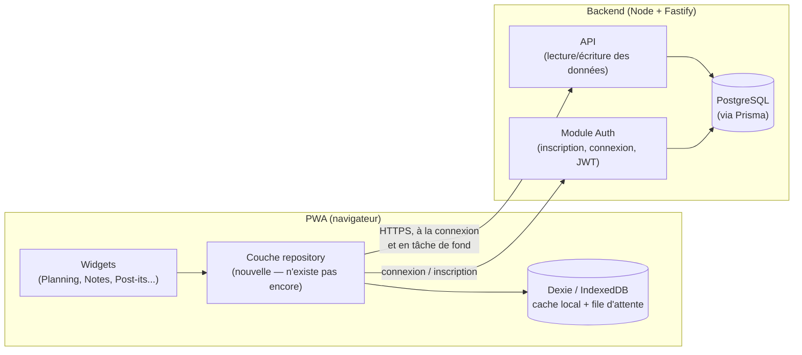
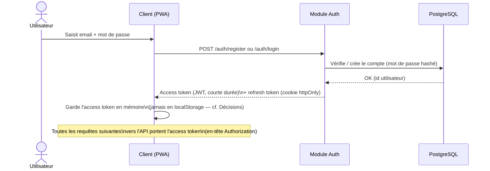
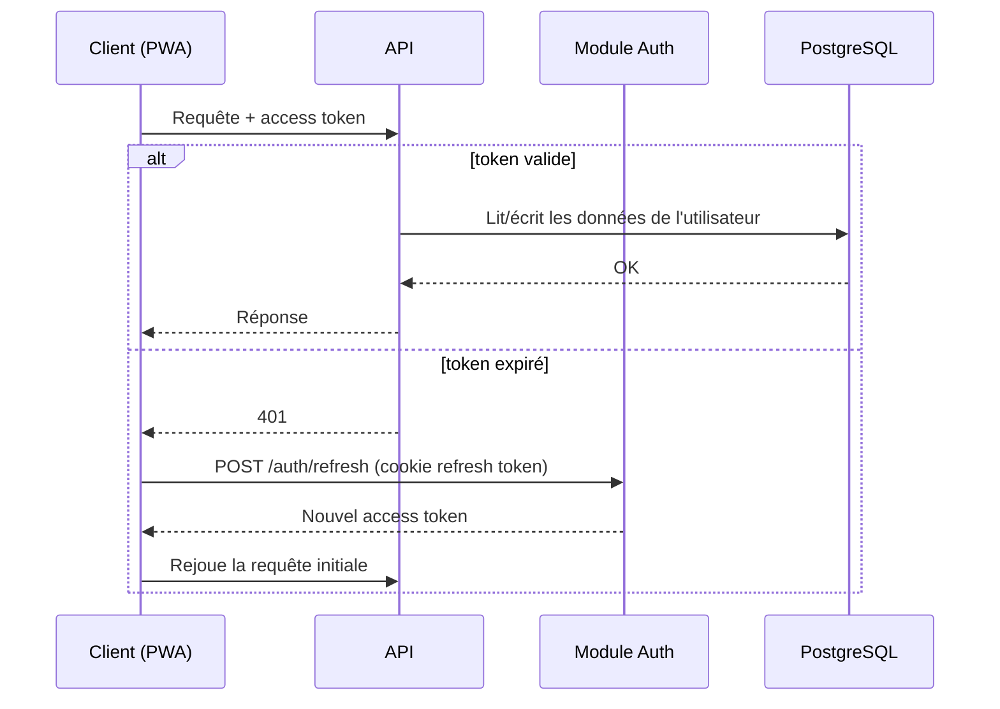
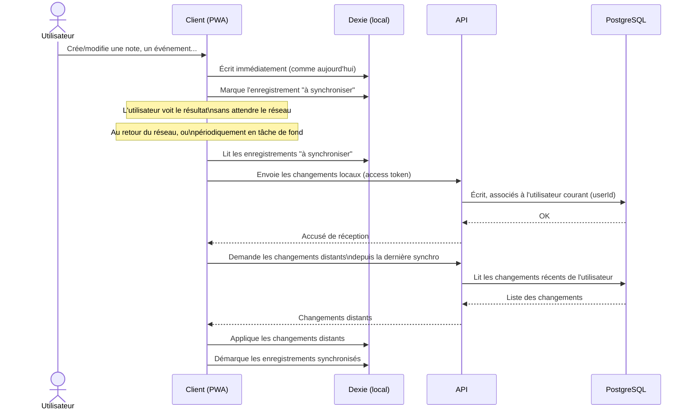
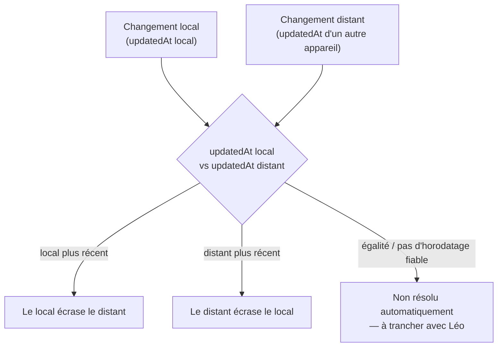

# Backend : persistance & gestion d'utilisateurs — architecture cible

Première pièce du dossier `documentation/`, à discuter avec Léo. Décrit
l'architecture **cible** (pas un état intermédiaire) pour les chantiers
"Comptes / authentification" et "Synchronisation multi-appareils",
aujourd'hui listés comme reportés dans `PROJECT.md` ("Reporté à plus
tard") — le frontend actuel n'a aucun backend, tout vit dans Dexie
(IndexedDB) local au navigateur.

## Stack retenue

- **API** : Node.js (Fastify) + TypeScript — cohérent avec le reste du
  monorepo (déjà 100 % TypeScript côté client).
- **Base de données** : PostgreSQL, via Prisma (migrations + client
  typé).
- **Authentification** : JWT — access token court (porté par le client à
  chaque requête) + refresh token longue durée (cookie `httpOnly`).
- **Synchronisation** : déclenchée par le client (retour réseau,
  intervalle), pas de canal temps réel dans une première version — plus
  simple à construire et suffisant pour un usage mono-utilisateur
  multi-appareils sans édition simultanée réelle. Un canal temps réel
  (WebSocket) reste une évolution possible si le besoin apparaît une fois
  l'usage réel observé.

Auto-hébergé (pas de service managé façon Supabase/Firebase) : contrôle
total sur l'auth, la logique de synchronisation et le modèle de données,
en échange de devoir construire et maintenir soi-même ce qu'un BaaS
aurait fourni (sécurité des requêtes, migrations, éventuel temps réel).

## Vue d'ensemble

Point structurant : **la couche repository doit exister côté client avant
ce chantier** (déjà noté dans `PROJECT.md`) — c'est le seul endroit qui
doit changer pour faire cohabiter Dexie (cache local) et le backend
(source de vérité partagée), sans toucher chaque widget un par un.

## Flux 1 — Inscription / connexion

## Flux 2 — Requête authentifiée / renouvellement de session

## Flux 3 — Écriture locale-first, puis synchronisation

Le principe local-first ne change pas : une action utilisateur reste
instantanée, backend disponible ou non.

## Flux 4 — Conflit entre deux appareils

Cas concret : la même note modifiée hors ligne sur deux appareils, avant
que l'un des deux n'ait pu synchroniser.

Stratégie retenue par défaut : dernier écrit gagne, sur `updatedAt` —
suffisante pour un usage mono-utilisateur multi-appareils sans édition
simultanée réelle. **Reste à trancher avec Léo** : la perte silencieuse
d'une modification (cas "distant plus récent" qui écrase un edit local
non encore synchronisé) est-elle acceptable telle quelle, ou faut-il au
moins un signal visible à l'utilisateur ?

## Ce qui change dans le modèle de données

Chaque table actuelle (`events`, `notes`, `postIts`, `tasks`, `todos`)
gagne, côté PostgreSQL :

- un identifiant de propriétaire `userId` (clé étrangère vers la table
  `users` créée par le module Auth) — permet à l'API de filtrer "les
  données de cet utilisateur" ;
- un horodatage de dernière modification `updatedAt` — nécessaire au
  Flux 4, absent du schéma Dexie actuel (à ajouter aussi côté client).

Le schéma Dexie local ne change pas de nature : il reste le cache/la file
d'attente locale, PostgreSQL devient la source de vérité partagée entre
appareils.

## Décisions déjà prises

- Stack : Node/Fastify + PostgreSQL/Prisma, auto-hébergé (pas de BaaS).
- Auth par JWT (access + refresh), access token jamais persisté en
  `localStorage` (surface XSS) — gardé en mémoire, renouvelé via le
  refresh token en cookie `httpOnly`.
- Synchronisation par déclenchement client (pas de temps réel en V1).
- Résolution de conflit : dernier écrit gagne, sur `updatedAt`.

## Points encore ouverts à trancher avec Léo

- Le cas "distant plus récent" du Flux 4 doit-il être totalement
  silencieux, ou signalé à l'utilisateur ?
- Ce que devient une donnée créée *avant* la création d'un compte :
  migration des données locales existantes vers le compte nouvellement
  créé, ou repartir de zéro ? (non couvert par les diagrammes ci-dessus)
- Mode d'inscription : email/mot de passe seul, ou aussi OAuth (Google...)
  en plus du JWT maison ?
- Granularité de la synchronisation (Flux 3) : enregistrement par
  enregistrement, ou par lot — impacte le coût réseau sur mobile.
