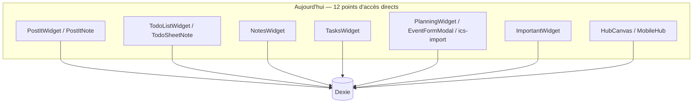
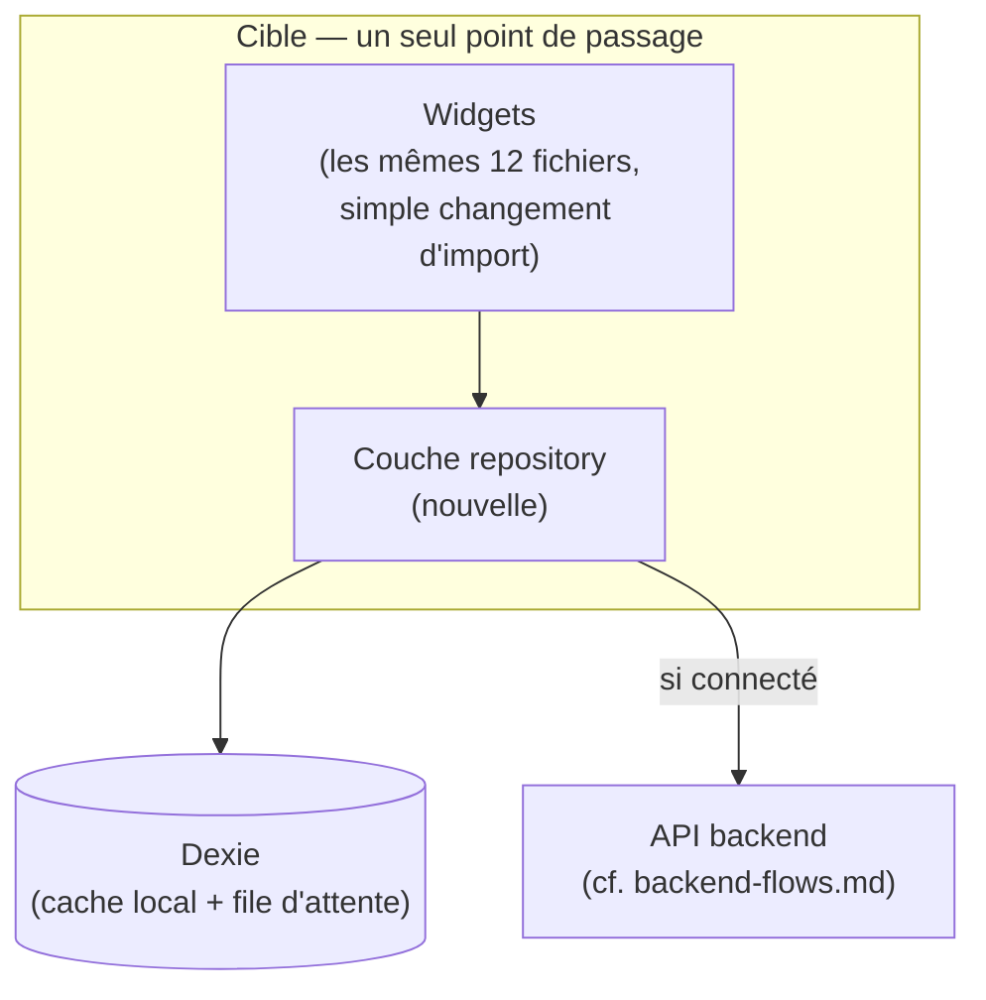
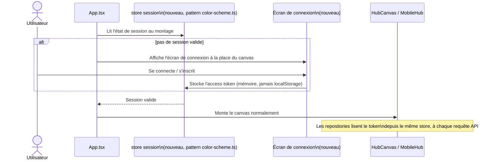

# Frontend : ce qui doit changer pour les comptes / la synchronisation

Quatrième pièce du dossier `documentation/`. Complète `backend-flows.md`
côté client : ce document décrit l'architecture backend **cible**, en
notant que "la couche repository doit exister côté client avant ce
chantier" — ce document explique concrètement ce que ça veut dire, à partir
de l'état réel décrit dans `frontend-architecture.md`.

## Le problème en une image

Aujourd'hui, 12 fichiers appellent `db.<table>.*` directement (voir
`frontend-architecture.md`, "Accès aux données aujourd'hui") — aucun point
de passage unique où intercepter la lecture/écriture pour, demain, la
faire aussi transiter par une API :

Le changement n'est **pas** une refonte du modèle de données ni de l'UI des
widgets : chaque widget continuerait de lire/écrire "ses" enregistrements de
la même façon logique — seul le point d'entrée change (`db.notes.add(...)`
devient `notesRepository.add(...)`, qui décide lui-même s'il écrit
seulement dans Dexie ou aussi vers l'API). C'est justement pour ça que ça
doit être fait **avant** de brancher un backend : le jour où l'API existe,
on ne veut pas retoucher les 12 fichiers un par un.

## Découpage envisagé de la couche repository

Un repository par table Dexie existante (`notesRepository`,
`postItsRepository`, `todoSheetsRepository`, `tasksRepository`,
`eventsRepository`), chacun exposant les mêmes opérations que Dexie
aujourd'hui (`add`/`update`/`delete`/`get`/`toArray`/liveQuery équivalent) —
une façade, pas une réécriture des requêtes. Tant qu'aucun compte n'existe,
chaque repository se comporte exactement comme l'accès direct actuel (écrit
uniquement dans Dexie) : **aucune régression fonctionnelle tant que le
backend n'est pas branché**, la migration peut donc se faire module par
module, indépendamment du reste du chantier comptes/sync.

## Où vivrait l'état de session

Par analogie avec `color-scheme.ts` (voir `frontend-ui-conventions.md`) :
l'état "utilisateur connecté ou pas / access token en mémoire" doit être lu
depuis plusieurs points indépendants (un futur écran de connexion, la
couche repository elle-même pour attacher le token aux requêtes, un futur
bouton "Se déconnecter" dans `ModuleDrawer`) — même famille de besoin que le
thème, donc probablement le même patron : un store externe
(`useSyncExternalStore`), pas un Context, pas un state React local à un
seul composant.

Point à trancher plus tôt que tard (impact structurant sur `App.tsx`) :
est-ce qu'un compte est **obligatoire** pour utiliser l'app (gate bloquant
avant tout rendu), ou l'app reste-t-elle utilisable hors-ligne/sans compte
avec la synchronisation comme option activée plus tard ? Le principe
local-first déjà en place (Dexie fonctionne aujourd'hui sans aucun réseau)
suggère la deuxième option, mais ça reste un choix produit, pas seulement
technique.

## Ce que ça implique pour les données déjà locales

`backend-flows.md` liste déjà cette question côté backend ("ce que devient
une donnée créée avant la création d'un compte"). Côté frontend, ça se
traduit concrètement par : si un utilisateur a déjà des notes/événements
dans Dexie (créés avant que les comptes n'existent, ou en tant qu'invité) et
crée un compte, faut-il proposer un écran "voici vos données locales,
associer à ce compte ?" — ou migrer silencieusement au premier login réussi.
Nécessite une décision produit avant d'écrire le code de la couche
repository (elle doit savoir, dès sa première version, si elle gère ce cas
ou si l'app repart de zéro).

## Récapitulatif des questions ouvertes côté frontend

- L'app reste-t-elle utilisable sans compte (mode invité local-first), ou
  un compte devient-il obligatoire ?
- Écran de connexion : une route/page dédiée, ou une modale par-dessus le
  canvas existant ?
- Migration des données locales pré-existantes vers un compte nouvellement
  créé : automatique, proposée à l'utilisateur, ou non gérée en V1 ?
- Ordre de migration des 12 fichiers vers la couche repository : un module
  à la fois (ex. Notes d'abord, le plus simple) ou tout d'un coup avant de
  toucher au backend ?
