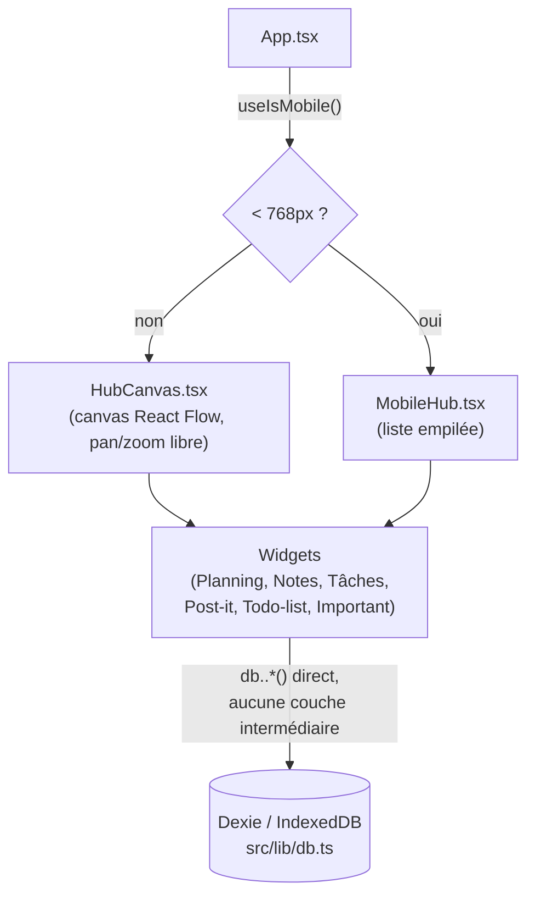
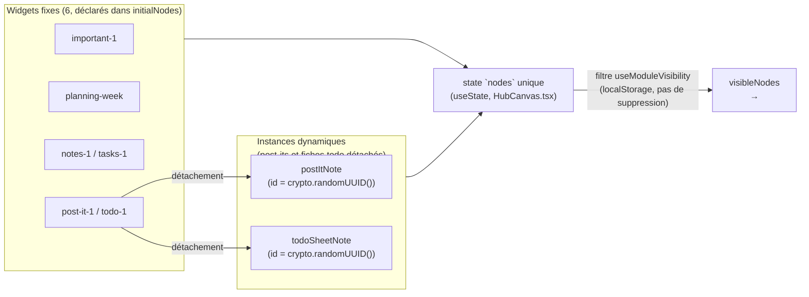
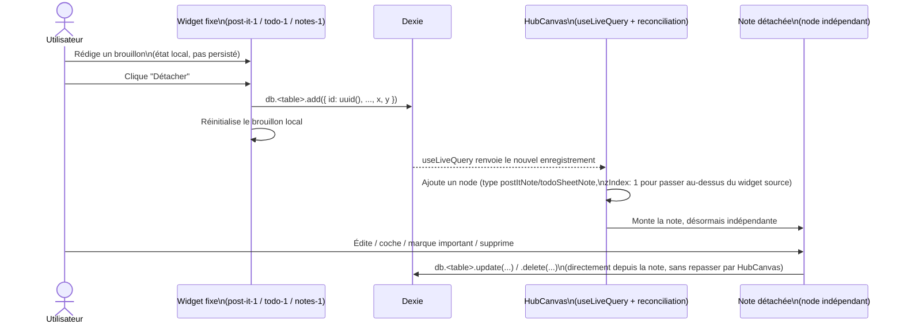

# Frontend : architecture canvas & widgets

Deuxième pièce du dossier `documentation/`, après `backend-flows.md`. Décrit
l'architecture **actuelle** du frontend (pas une cible) : comment le canvas,
les widgets et Dexie s'articulent aujourd'hui. Sert de socle à
`frontend-accounts-readiness.md`, qui explique ce qui doit changer ici pour
accueillir les comptes/synchronisation décrits dans `backend-flows.md`.

## Vue d'ensemble

Les deux layouts (desktop/mobile) rendent **les mêmes composants widgets**
(`widget-components.tsx`, partagé) — seule la structure autour change (canvas
zoomable vs liste empilée). Aucun des deux n'est un cas particulier de
l'autre : `App.tsx` choisit l'un ou l'autre au montage, jamais les deux à la
fois.

## Le canvas et ses nodes (`HubCanvas.tsx`)

Six widgets fixes sont déclarés une fois pour toutes (`initialNodes`), avec
la convention **id = type** (`'notes-1'`, `'todo-1'`, `'planning-week'`...) :
un seul id sert à la fois d'identifiant du node et de clé pour retrouver son
composant dans `WIDGET_COMPONENTS` — pas de nom de "type" séparé, puisque
chaque module fixe n'a qu'une seule instance.

Point important, déjà payé cher une fois : les nodes dynamiques (post-its,
fiches todo) vivent dans **le même état `nodes`** que les widgets fixes, pas
dans un état séparé "dérivé de Dexie". Une tentative antérieure de garder
leur position purement dérivée de Dexie (en dehors de `nodes`) cassait le
suivi interne du drag de React Flow — le node disparaissait pendant qu'on le
déplaçait. Dexie ne sert donc que de **persistance**, synchronisée :
- *vers* `nodes` à la création/suppression (un `useEffect` réconcilie
  `db.postIts.toArray()`/`db.todoSheets.toArray()`, via `useLiveQuery`, avec
  les nodes de type `postItNote`/`todoSheetNote` déjà présents) ;
- *depuis* `nodes` en fin de glisser (`onNodesChange` écrit `{x, y}` dans
  Dexie uniquement quand un changement de type `position` a `dragging`
  devenu faux, jamais en continu pendant le drag).

Les widgets fixes, eux, n'ont pas leur position persistée : elle repart de
`initialNodes` à chaque rechargement.

**Visibilité** (`module-visibility.ts`) : un `Set` d'ids masqués, persisté
dans `localStorage` (`global-hub:hidden-modules`), appliqué comme un simple
filtre au rendu (`visibleNodes = nodes.filter(...)`). Rien n'est supprimable
de cette façon — masquer un module ne touche pas Dexie. Masquer un module à
instances (Post-it, Todo-list) cascade sur toutes ses instances enfants ;
masquer une instance individuelle ne remonte jamais au module parent.

## Registre des modules

- `module-registry.ts` : tableau ordonné `MODULES`, une entrée par module
  fixe (`{ id, labelKey, icon, defaultThemeId, defaultStyleId,
  instanceKind? }`). `instanceKind: 'postIt' | 'todoSheet'` marque les deux
  modules qui ont des instances détachables. Cet ordre pilote l'affichage du
  drawer et la disposition par défaut du canvas.
- `widget-components.tsx` : `WIDGET_COMPONENTS`, la table id → composant,
  réutilisée à l'identique par `HubCanvas` (nodeTypes React Flow) et
  `MobileHub` (rendu direct par id, aucune notion de node côté mobile).
- `ModuleDrawer.tsx` lit `MODULES` pour les tuiles de bascule
  affiché/masqué, et ajoute une ligne par instance vivante (post-it/fiche
  todo) pour les modules à `instanceKind`.

## Les trois providers transverses

Trois contextes React entourent tout le canvas (`ModuleThemeProvider` >
`ModuleStyleProvider` > ... > `ModuleNavigationProvider`), consommés par des
widgets profondément imbriqués :

| Provider | État | Persistance |
|---|---|---|
| `module-theme.tsx` | couleur de header choisie par module (`Record<moduleId, themeId>`) | `localStorage` |
| `module-style.tsx` | style de header par module (`'wave' \| 'flat'`) | `localStorage` |
| `module-navigation.tsx` | une requête d'ouverture ponctuelle (`{module, id} \| null`) | mémoire seulement |

Ce sont des préférences d'affichage ou de la coordination éphémère entre
widgets — jamais des données de domaine, donc jamais dans Dexie. À l'inverse,
`useModuleVisibility` n'a qu'un seul consommateur à la fois (`HubCanvas` ou
`MobileHub`, jamais les deux) : un simple hook suffit, pas besoin de Context.

## Le pattern brouillon → détachement

Post-it, Todo-list et Notes (en partie) partagent la même mécanique :

Une fois détachée, chaque note gère ses propres écritures Dexie
directement (pas de va-et-vient par le widget d'origine) — cf. la section
suivante sur ce que ça implique pour une future couche d'accès aux données.

## Accès aux données aujourd'hui

`src/lib/db.ts` : une seule classe Dexie (`HubDatabase`, base `global-hub`),
6 tables (`events`, `notes`, `postIts`, `todoSheets`, `tasks`, `todos`),
toutes indexées par un `id` string (UUID). Schéma versionné de façon
purement additive jusqu'ici (nouvel index, nouvelle table) — aucune
migration de données (`.upgrade()`) n'a encore été nécessaire.

**Aucune couche d'abstraction n'existe** : chaque widget importe `db` et
appelle `db.<table>.*` directement, mélangé à `useLiveQuery`
(`dexie-react-hooks`). 12 fichiers font cet accès direct aujourd'hui —
`HubCanvas.tsx`, `MobileHub.tsx`, et les widgets/notes de Important, Notes,
Planning (+ `EventFormModal`, `ics-import.ts`), Post-it (widget + note),
Tâches, Todo-list (widget + note). Ce constat, factuel et sans jugement (le
choix était pertinent pour la taille du projet jusqu'ici), est le point de
départ de `frontend-accounts-readiness.md`.
