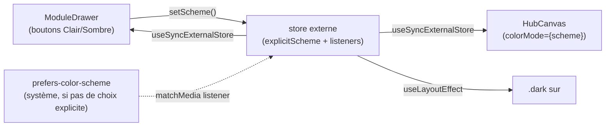

# Frontend : conventions transverses (i18n, thème, mobile, PWA, a11y, tests)

Troisième pièce du dossier `documentation/`. Complète
`frontend-architecture.md` (canvas/widgets/données) avec les préoccupations
qui traversent tous les modules plutôt que d'appartenir à l'un d'eux.

## Internationalisation

`react-i18next`, sans détecteur automatique (`i18next-browser-
languagedetector` non utilisé) : `loadStoredLanguage()`
(`src/i18n/index.ts`) lit `localStorage['global-hub:language']`, sinon
retombe sur `'fr'` (aussi `fallbackLng`). Deux fichiers de ressources plats
(`fr.json`/`en.json`), volontairement sans découpage par namespace/module —
choix documenté comme provisoire, à revoir une fois plus de modules traduits
(principe "pas d'abstraction prématurée").

- Consommation : `useTranslation()` dans chaque composant.
- Changement de langue : `src/canvas/language.ts` (`useLanguage()`), un
  simple hook (pas de Context — i18next garde déjà l'état en mémoire et
  notifie `useTranslation` lui-même) qui appelle `i18n.changeLanguage()` et
  persiste dans le même `localStorage`.
- UI : boutons FR/EN dans `ModuleDrawer.tsx`.

## Thème clair/sombre

`src/canvas/color-scheme.ts` : store externe (`useSyncExternalStore`), pas
un Context — nécessaire parce que `useColorScheme()` est consommé depuis
**deux points de montage indépendants** (`ModuleDrawer` pour le switch,
`HubCanvas` pour le prop `colorMode` de React Flow) ; un `useState` local à
chacun les désynchroniserait.

`scheme = explicit ?? system` : tant qu'aucun choix explicite n'a été fait,
suit le système en direct ; un choix explicite (persisté dans
`localStorage['global-hub:color-scheme']`) prend le dessus et ignore les
changements système ensuite. `useLayoutEffect` (pas `useEffect`) pose la
classe `.dark` avant peinture, pour éviter un flash clair→sombre au premier
rendu. Côté CSS, Tailwind v4 utilise un variant personnalisé
(`@custom-variant dark (&:is(.dark *))`, `index.css:6`) plutôt que la média
query native — tous les tokens `dark:`/variables CSS répondent à cette
classe, pas directement au système.

## Layout responsive (desktop / mobile)

`useIsMobile()` (`src/canvas/use-is-mobile.ts`) : `matchMedia('(max-width:
767.98px)')`, aligné exactement sur le breakpoint Tailwind `md:` (768px)
pour que le branchement JS et les classes CSS responsives ne divergent
jamais. Basculement au niveau racine (`App.tsx`) : `HubCanvas` (canvas
libre, pan/zoom) OU `MobileHub` (liste empilée), jamais les deux montés en
même temps.

Pourquoi une liste empilée plutôt que le même canvas réduit : le
pinch-zoom entre en conflit avec le scroll de page, et la sélection de
plage horaire par glisser (WeekGrid) ne fonctionne pas bien au tactile.
Astuce technique notable : plusieurs widgets (`PostIt`, `TodoList`, `Notes`,
`Planning`, `Important`) utilisent `useNodeId()`/`useReactFlow()` en interne
(pour calculer une position de spawn ou un `fitView`) — les monter sous
`MobileHub` les oblige à rester dans un `<ReactFlowProvider>` (sans
`<ReactFlow>` réel dessous) pour que ces hooks restent des no-op silencieux,
sans changer une ligne des widgets eux-mêmes. Visibilité par défaut
restreinte au module Planning seul sur mobile (`DEFAULT_MOBILE_HIDDEN_IDS`),
les autres modules restant accessibles via le drawer.

## PWA

`vite-plugin-pwa`, stratégie `generateSW` (pas de service worker
personnalisé), `registerType: 'autoUpdate'`. Manifest minimal (nom,
description FR, `display: 'standalone'`). **Gap connu, toujours présent** :
`icons: []` — l'app ne peut probablement pas s'installer proprement sur un
écran d'accueil mobile tant que ça n'est pas rempli (déjà noté dans
`PROJECT.md`, "À affiner").

## Accessibilité

Conventions établies (`CONTRIBUTING.md`, section "Accessibilité"), issues
d'un audit réel (2026-08-19, 7 violations trouvées et corrigées) :

- Tout élément interactif icône-seule (pas de texte visible) → `aria-label`.
- Tout champ de formulaire sans `<label>` visible → `aria-label` explicite.
- Jamais de `
` pour un élément cliquable → un vrai `<button
  type="button">` (focusable, activable au clavier nativement).
- Tout nouveau texte sur fond coloré → contraste vérifié (WCAG AA, 4.5:1),
  pas seulement à l'œil ; toute nouvelle landmark (`nav`, `main`) → vérifier
  qu'elle ne fait pas apparaître de contenu "hors landmark" ailleurs.
- Les correctifs eux-mêmes doivent être re-vérifiés par un outil
  (`@axe-core/playwright`), pas seulement jugés "plausibles" à la lecture —
  plusieurs correctifs antérieurs avaient introduit de nouveaux bugs sans
  cette vérification.

## Tests

Deux couches, pas redondantes :
- **Vitest** (mode navigateur, Chromium) : composants (`*.test.tsx`
  colocalisés, 31 fichiers) — rendu + comportement d'un composant isolé,
  plus un projet `unit` (logique pure, `*.test.ts`) et un projet
  `storybook` (tests basés sur les stories).
- **Playwright** (`e2e/*.spec.ts`, 10 fichiers) — scénarios bout-en-bout
  dans un vrai navigateur, y compris les scans `@axe-core/playwright`.

Un composant isolé se teste en Vitest ; une interaction qui traverse
plusieurs composants, le canvas React Flow, ou qui doit être vérifiée
visuellement (capture d'écran) va en e2e.
